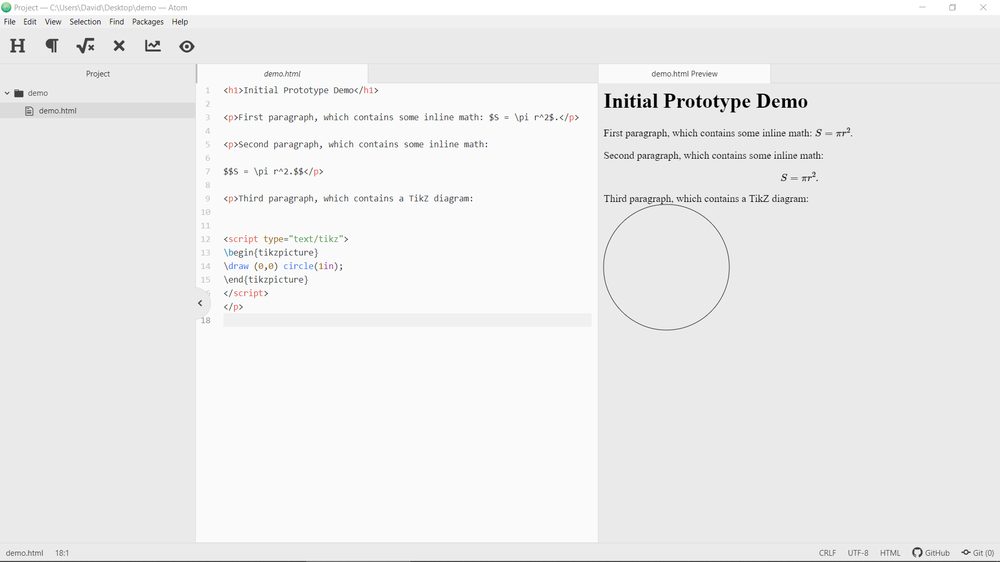
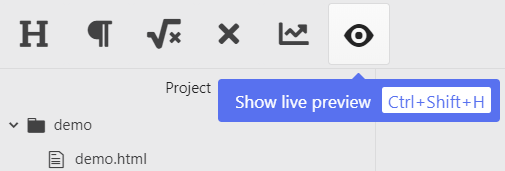

[Poznámky](../README.md)
| Prototyp

---

# Prototyp

## Ukázka

[YouTube video](https://youtu.be/aO9yJzLfSO4) (délka 2:28; bez zvuku)

*(v ukázce je drobná chybka: píšu, že druhý odstavec obsahuje inline matematiku,
ale ve skutečnosti obsahuje matematiku blokovou, jen jsem to zapomněl po
zkopírovaní prvního odstavce přepsat)*

